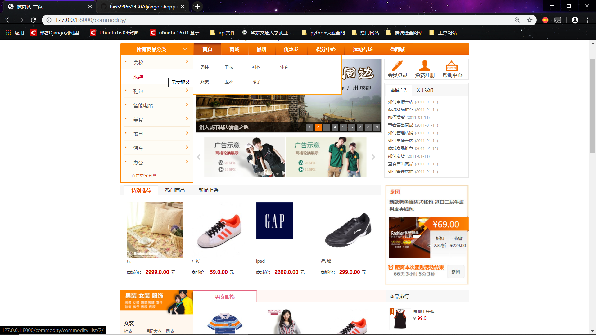
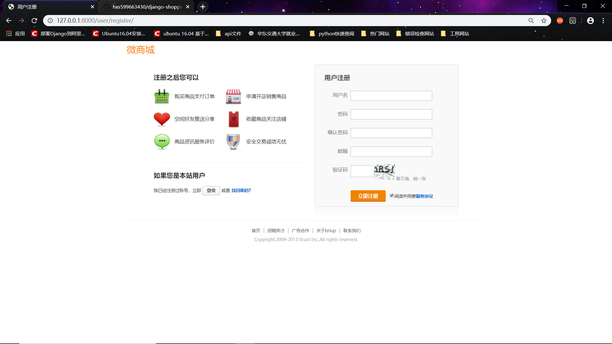
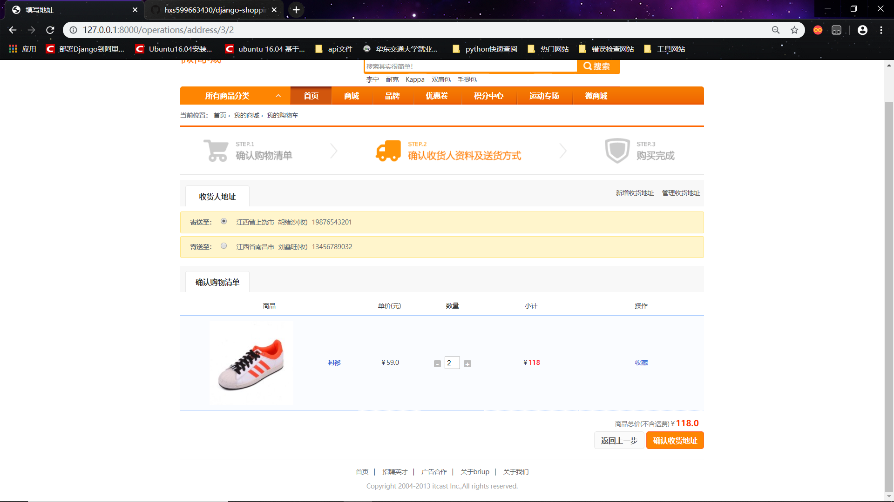
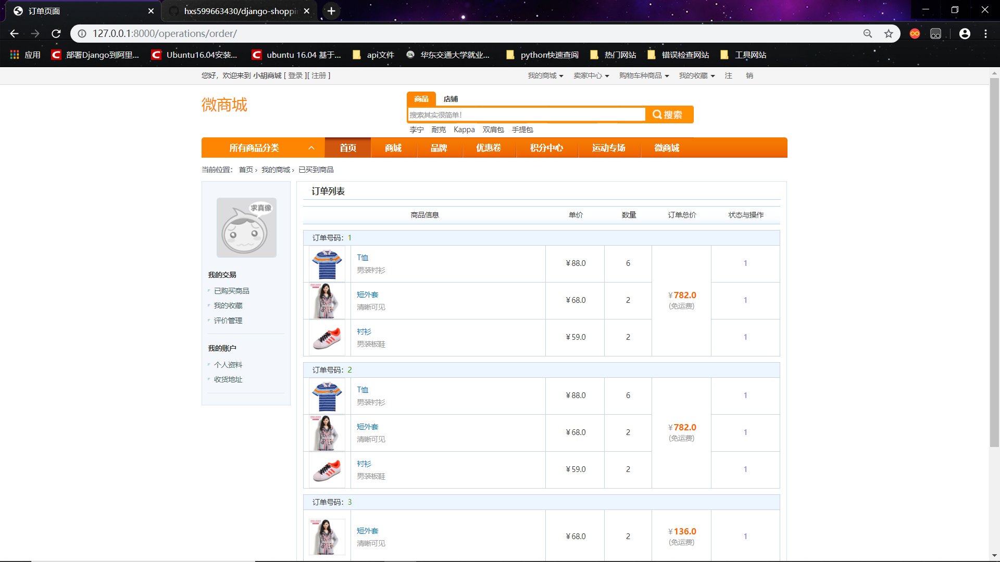
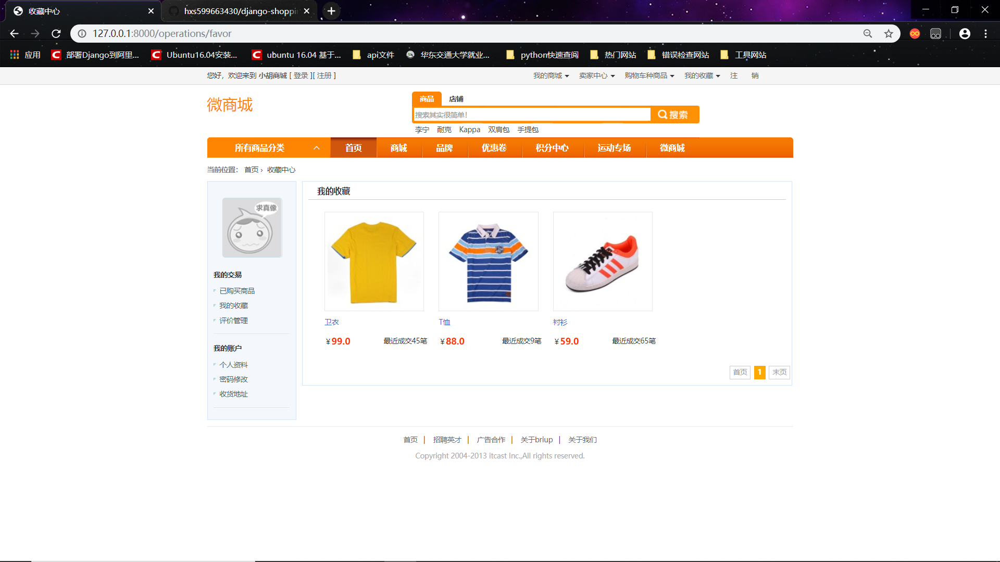

# 基于pythonweb框架Django开发的微商城

#### 项目开始

​	项目背景：类似独家商城的商城购物功能

​	技术使用：前台页面模板、python、django框架

​	项目介绍：前台页面主要完成了商品展示、购买、收藏、加入购物车、选择详细地址、生成订单、注册登录的功能，必要功能必须登录才能操作商品。后台使用django自带的后台管理界面

​		1、首页（商品展示）：商品分类是根据后台数据自动生成的

​		2、注册界面：

​		3、登录界面：

​		4、商品详细页面：

​		5、加入购物车页面：

​		6、选择详细地址界面：

​		7、订单界面：里面多余的订单是我测试时保留下来的，忘了删除

​		8、商品收藏界面：里面多余的商品是我测试收藏时保留下来的，忘了删除

